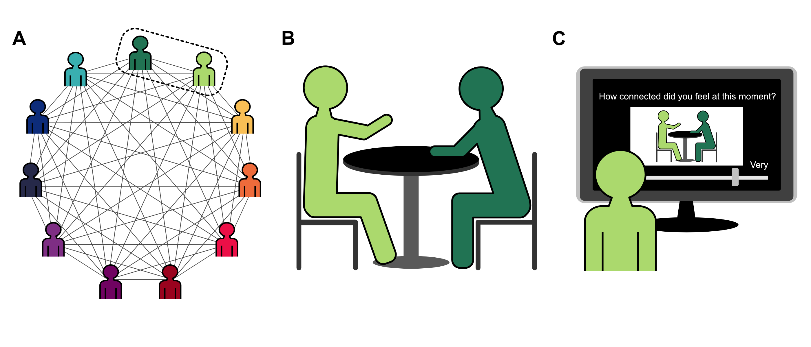

# About Me

Hi! I'm a postdoctoral fellow in Psychological and Brain Sciences at Dartmouth, where I also completed my PhD. I work with [Thalia Wheatley](http://www.wheatlab.com/) and [Luke Chang](https://cosanlab.com/). The question that motivates my research is: **What makes conversation "good"?**

Before graduate school, I received my A.B. in Psychology from Harvard where I worked with [Jason Mitchell](https://jasonmitchell.fas.harvard.edu/) and [Diana Tamir](https://psnlab.princeton.edu/). Then, I worked as a lab manager at Stanford in [Jamil Zaki](https://www.ssnl.stanford.edu/)'s lab.

I love building community wherever I go. I’ve been fortunate to formally contribute to student residential life in my role as a [Resident Fellow](https://students.dartmouth.edu/residential-life/house-communities/resident-fellows) in [East Wheelock House](https://sites.dartmouth.edu/ew/) for the past five years.

# My Research

I study **conversation**. 

We’ve all had the experience of meeting someone and hitting it off right away. We’ve also all had the experience of meeting someone and just not being able to connect with them no matter how hard you try. What happens in an interaction that determines this outcome? 

I use **data-driven**, **naturalistic** approaches to explore this question.

I’ve collected a large round-robin dataset where every member of each round-robin has a conversation with every other member. I quantify different aspects of these conversations to examine how conversation behavior relates to participant reports of enjoyment and connection. The round-robin network structure makes it possible to look at multiple levels of analyses: within conversations, across conversations, and across individual people. 

In addition to this round-robin conversation dataset, I’ve also collected different conversation types (friends vs strangers) as well as formats (face-to-face vs online).

Of course, I like to follow up any findings from these naturalistic datasets with controlled **experimental studies**. However, I think there is real value in having insights come from the data *itself* rather than intuition *alone*. After all, I  only have access to my own conversations! I might mistakenly believe everyone loves keeping up with the Kardashians as much as I do (and unfortunately, I would be wrong).

# Publications

### // Published

Di Stasi, M., **Templeton, E.** & Quoidbach, J. (in press). Zooming Out on Bargaining Tables: Exploring Which Conversation Dynamics Predict Negotiation Outcomes. *Journal of Applied Psychology*.

Cox, C., **Templeton, E.**, & Fusaroli, R. (in press). Fine-Tuning Social Timing: From Non-Human to Human Animals and Back. A Commentary on “The Evolution of Social Timing” by Verga, Kotz, and Ravignani. *Physics of Life Reviews*.

**Templeton, E.** & Wheatley, T. (2023). Listening fast and slow. *Current Opinion in Psychology.* [[paper]](https://www.sciencedirect.com/science/article/pii/S2352250X23001033).

**Templeton, E.**, Chang, L., Reynolds, E., Cone LeBeaumont, M., & Wheatley, T. (2023). Long gaps between turns are awkward for strangers but not for friends. *Phil. Trans. R. Soc. B.* [[paper]](https://royalsocietypublishing.org/doi/10.1098/rstb.2021.0471) [[data & materials]](https://github.com/emtempleton/LongGaps)

Wood, A., **Templeton, E.**, Morrel, J., Schubert, F., & Wheatley, T. (2022). Tendency to laugh is a stable trait: Findings from a round-robin conversation study. *Phil. Trans. R. Soc. B.* [[paper]](https://royalsocietypublishing.org/doi/10.1098/rstb.2021.0187) [[data & materials]](https://osf.io/tfxa7/)

**Templeton, E.**, Chang, L., Reynolds, E., Cone LeBeaumont, M., & Wheatley, T. (2022). Fast response times signal social connection in conversation. *Proceedings of the National Academy of Sciences.* [[paper]](https://www.pnas.org/content/119/4/e2116915119) [[data & materials]](https://github.com/emtempleton/GapPaper)

Wei, J., Finn, K., **Templeton, E.**, Wheatley, T., & Vosoughi, S. (2021). Linguistic complexity loss in text-based therapy. In *Proceedings of the 2021 Conference of the North American Chapter of the Association for Computational Linguistics.* [[paper]](https://aclanthology.org/2021.naacl-main.352.pdf)

Tamir, D.\*, **Templeton, E.\***, Ward, A., & Zaki, J. (2018). Media usage diminishes memory for experiences. *Journal of Experimental Social Psychology.* [[paper]](https://www.sciencedirect.com/science/article/pii/S002210311730505X?casa_token=F27U5RpEeZ4AAAAA:-dEJOuxzgmUMdIk31KazeLXgQdNZX9Q-kYfKv0b8div-UGf5U44NIjFfmEwdan_c35Mgh68) [[data & materials]](https://osf.io/uqh5d/) **\*** Denotes equal contribution

**Templeton, E.**, Stanton, M., & Zaki, J. (2016). Social norms shift preferences for healthy and unhealthy foods. *PLoS ONE.* [[paper]](https://journals.plos.org/plosone/article?id=10.1371/journal.pone.0166286) [[data & materials]](https://github.com/emtempleton/FoodPaper)

Jordan, J., Rutter, E., & **Templeton, E.** (2012). Twenty-first Century Doodling: How does Facebook Use Impact Memory of Lecture Content?. *The Harvard Undergraduate Research Journal.* [[paper]](THURJ.pdf)

### // Under Review or In Preparation 

**Templeton, E.**, Chang, L., Cone LeBeaumont, M., & Wheatley, T. (in prep). From talk to telepathy: The social benefits of saying more with less. 

**Templeton, E.**, Chang, L., & Wheatley, T. (in prep). Launch pad topics facilitate finding common ground. 

Welker, C., **Templeton, E.**, & Wheatley, T. (in prep). The affective benefits of diversified social interaction. 

